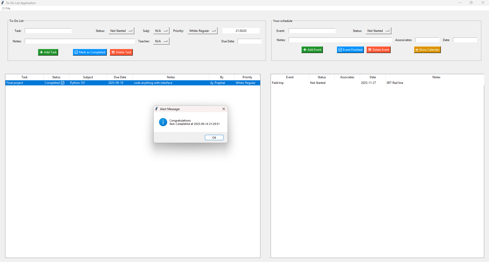

# My Notion

## Introduction:

A Graphical User Interface (GUI) created as a task and event scheduling written by Python. The program use Tkinter module for the display window following by JSON and OS module for the data saver and loader. 
The program is able to input both task and event, prioritize it, add details for memorization, and save the data on to the local device.
Current Version: 1.0.0 

## Improvements:

1. Interface improvement for more user experience
2. Browsing for data saver location
3. Able to set alarm clock
4. CPM - PERT
5. Human Resource Management (Assigning work)

## NOTED:
For Editing | Username: Test_user / Password: 0123
